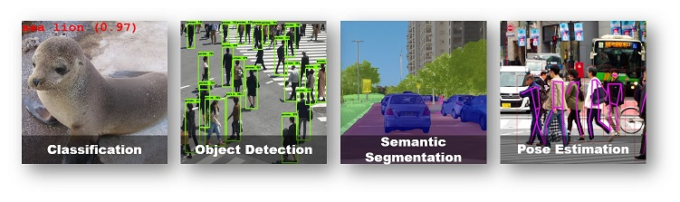
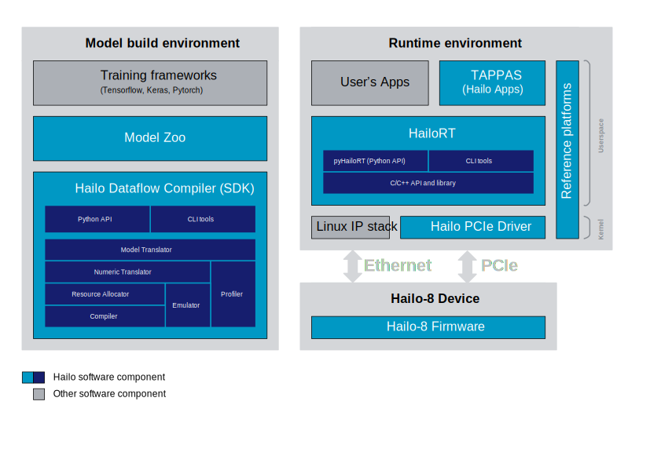

# Hailo Model Zoo #

The Hailo Model Zoo provides pre-trained models for high-performance deep learning applications. Using the Hailo Model Zoo you can measure the full precision accuracy of each model, the quantized accuracy using the Hailo Emulator and measure the accuracy on the Hailo-8 device. Finally, you will be able to generate the Hailo Executable Format (HEF) binary file to speed-up development and generate high quality applications accelerated with Hailo-8. The models are optimized for high accuracy on public datasets and can be used to benchmark the Hailo quantization scheme.

<p align="center">
  
</p>


## Usage

### Quick Start Guide
* Enter the Hailo Dataflow Compiler virtualenv
* run the setup script
```
pip install -e .
```
* run the Hailo Model Zoo. For example, to parse the YOLOv3 model:
```
python hailo_model_zoo/main.py parse yolov3
```

### Getting Started

For further functionality please see the [**GETTING_STARTED**](docs/GETTING_STARTED.md) page (full install instructions and usage examples). The Hailo Model Zoo is using the Hailo Dataflow Compiler for parsing, quantization, emulation and compilation of the deep learning models. Full functionality includes:
* Parse: model translation of the input model into Hailo's internal representation.
* Profiler: generate profiler report of the model. The report contains information about your model and expected performance on the Hailo hardware.
* Quantize: numeric translation of the input model into a compressed integer representation.
* Compile: run the Hailo compiler to generate the Hailo Executable Format file (HEF) which can be executed on the Hailo hardware.
* Evaluate: infer the model using the Hailo Emulator or the Hailo hardware and produce the model accuracy.

For further information about the Hailo Dataflow Compiler please contact [**hailo.ai**](http://hailo.ai).

<p align="center">
  
</p>


## Models

Here, we give the full list of models supported by the Hailo Model Zoo.

| Classification | Full Precision Top-1 (ImageNet) | Input Resolution (HxWxC) | Params (M) | Flops (G) |
| -------------- | ------------------------- | ------------------------ | ---------- | --------- |
| efficientnet_l | 80.47 | 300x300x3 | 9.01 | 9.68 |
| efficientnet_m | 78.98 | 240x240x3 |5.58 | 3.67 | 
| efficientnet_s | 77.61 | 224x224x3 | 4.13 | 2.36 |
| efficientnet_lite0 | 74.93 | 224x224x3 | 3.35 | 0.39 |
| efficientnet_lite1 | 76.66 | 240x240x3 | 4.11 | 0.60 |
| efficientnet_lite2 | 77.44 | 260x260x3 | 4.78 | 0.86 |
| efficientnet_lite3 | 79.2  | 280x280x3 | 6.88 | 1.39 |
| efficientnet_lite4 | 80.64 | 300x300x3 | 11.67 | 2.56 |
| inception_v1 | 69.76 | 224x224x3 | 5.59 | 1.5 |
| mobilenet_v1 | 71.02 | 224x224x3 | 3.2 | 0.57 |
| mobilenet_v2_1.0 | 71.84 | 224x224x3 | 2.21 | 0.31 |
| mobilenet_v2_1.4 | 74.11 | 224x224x3 | 4.29 | 0.59 |
| mobilenet_v3 | 72.27 | 224x224x3 | 2.79 | 1.0 |
| mobilenet_v3_large_minimalistic | 72.29 | 224x224x3 | 1.4 | 0.21 |
| regnetx_1.6gf | 77.07 | 224x224x3 | 8.26 | 1.61 |
| regnetx_800mf | 75.07 | 224x224x3 | 6.57 | 0.80 |
| regnety_200mf | 70.32 | 224x224x3 | 3.15 | 0.2 |
| resnet_v1_18 | 68.84 | 224x224x3 | 11.17 | 1.82 |
| resnet_v1_34 | 72.68 | 224x224x3 | 21.28 | 3.67 |
| resnet_v1_50 | 75.21 | 224x224x3 | 23.48 | 3.49 |
| resnet_v2_18 | 69.58 | 224x224x3 | 11.17 | 1.82 |
| resnet_v2_34 | 73.10 | 224x224x3 | 21.28 | 3.67 |
| resnext26_32x4d | 76.08 | 224x224x3 | 13.33 | 2.51 |
| resnext50_32x4d | 79.43 | 224x224x3 | 22.96 | 4.29 |
| shufflenet_g8_w1 | 66.29 | 224x224x3 | 0.92 | 0.18 |
| squeezenet_v1_1 | 59.88 | 224x224x3 | 1.24 | 0.39 |
  
| Object Detection | Full Precision mAP (COCO2017) | Input Resolution (HxWxC) | Params (M) | Flops (G) |
| -------------- | ------------------------- | ------------------------ | ---------- | --------- |
| centernet_resnet_v1_18 | 26.37 | 512x512x3 | 14.23 | 	15.73	 |
| ssd_mobiledet_dsp | 28.9 | 320x320x3 | 	7.07 | 2.83 |
| ssd_mobilenet_v1 | 23.18 | 300x300x3 | 	6.79 | 1.25 |
| ssd_mobilenet_v1_hd | 17.67 | 720x1280x3 | 6.81 | 	12.26	 |
| ssd_mobilenet_v2 | 24.27 | 300x300x3 | 4.46 | 0.76 |
| ssd_resnet_v1_18 | 17.68 | 300x300x3 | 16.62 | 	3.54 |
| tiny_yolov3 | 14.22 | 416x416x3 | 8.85 | 	2.79 |
| tiny_yolov4 | 18.89 | 416x416x3 | 6.05 | 3.46 |
| yolov3 | 32.62 | 608x608x3 | 68.79 | 79.17	 |
| yolov3_416 | 36.06 | 416x416x3 | 68.79 | 37.06	 |
| yolov4 | 42.4 | 512x512x3 | 66.05 | 	47.36 |
| yolov5xs* | 32.74 | 512x512x3 | 7.91 | 	5.8 |
| yolov5s* | 34.36 | 640x640x3 | 7.91 | 	9.06 |
| yolov5m* | 41.7 | 640x640x3 | 22.95 | 	27.33 |
  
\* Trained without the SPP block  
      
| Semantic Segmentation | Full Precision mIoU (Cityscapes) | Input Resolution (HxWxC) | Params (M) | Flops (G) | Output Stride |
| -------------- | ------------------------- | ------------------------ | ---------- | --------- | ------------ |
| fcn8_resnet_v1_18 | 66.62 | 1024x1920x3 | 11.2 | 	71.51	 | 32 |
| fcn8_resnet_v1_22 | 68.11 | 1024x1920x3 | 15.12 | 150.04 | 16 |
| fcn16_resnet_v1_18 | 	65.54 | 1024x1920x3 | 		11.19 | 71.26	 | 32 |
| fcn16_resnet_v1_18_8_classes | 76.04 | 1024x1920x3 | 	11.18 | 	71.19 | 32 |
  
| Pose Estimation | Full Precision AP (COCO2017) | Input Resolution (HxWxC) | Params (M) | Flops (G) |
| -------------- | ------------------------- | ------------------------ | ---------- | --------- |
| centerpose_regnetx_800mf | 44.4 | 512x512x3 | 12.31 | 	43.06	 |
| centerpose_regnetx_1.6gf_fpn | 53.9 | 640x640x3 | 14.36 | 32.71 |
  
 networks available in [**TAPPAS**](https://hailo.ai/developer-zone/tappas-apps-toolkit/)  

## Citation

If you find our code or models helpful in your research, please consider citing our papers:

```
@InProceedings{Finkelstein2019,
  title = {Fighting Quantization Bias With Bias},
  author = {Alexander Finkelstein and Uri Almog and Mark Grobman},
  booktitle = {CVPR},
  year = {2019}
}
@InProceedings{Meller2019,
  title = {Same, Same But Different - Recovering Neural Network Quantization Error Through Weight Factorization},
  author = {Eldad Meller and Alexander Finkelstein and Uri Almog and Mark Grobman},
  booktitle = {ICML},
  year = {2019}
}
```

## License

The Hailo Model Zoo is released under the MIT license. Please see the [**LICENSE**](./LICENSE) file for more information.

## Contact

Please visit [**hailo.ai**](https://hailo.ai/) for support / requests / issues.