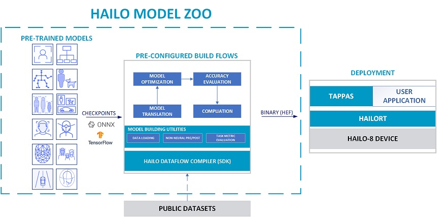

<p align="left">
  
</p>  


# Hailo Model Zoo #

The Hailo Model Zoo provides pre-trained models for high-performance deep learning applications. Using the Hailo Model Zoo you can measure the full precision accuracy of each model, the quantized accuracy using the Hailo Emulator and measure the accuracy on the Hailo-8 device. Finally, you will be able to generate the Hailo Executable Format (HEF) binary file to speed-up development and generate high quality applications accelerated with Hailo-8. The models are optimized for high accuracy on public datasets and can be used to benchmark the Hailo quantization scheme.

<p align="center">
  
</p>


## Usage

### Quick Start Guide
* Install the Hailo Dataflow Compiler and enter the virtualenv. In case you are not Hailo customer please contact [**hailo.ai**](https://hailo.ai/contact-us/)
* Clone the Hailo Model Zoo
```
git clone https://github.com/hailo-ai/hailo_model_zoo.git
```
* Run the setup script
```
cd hailo_model_zoo; pip install -e .
```
* Run the Hailo Model Zoo. For example, to parse the YOLOv3 model:
```
python hailo_model_zoo/main.py parse yolov3
```

### Getting Started

For further functionality please see the [**GETTING_STARTED**](docs/GETTING_STARTED.md) page (full install instructions and usage examples). The Hailo Model Zoo is using the Hailo Dataflow Compiler for parsing, quantization, emulation and compilation of the deep learning models. Full functionality includes:
* Parse: model translation of the input model into Hailo's internal representation.
* Profiler: generate profiler report of the model. The report contains information about your model and expected performance on the Hailo hardware.
* Quantize: numeric translation of the input model into a compressed integer representation.
* Compile: run the Hailo compiler to generate the Hailo Executable Format file (HEF) which can be executed on the Hailo hardware.
* Evaluate: infer the model using the Hailo Emulator or the Hailo hardware and produce the model accuracy.

For further information about the Hailo Dataflow Compiler please contact [**hailo.ai**](https://hailo.ai/contact-us/).

<p align="center">
  
</p>


## Models

Full list of pre-trained models can be found [**here**](docs/MODELS.md).

## License

The Hailo Model Zoo is released under the MIT license. Please see the [**LICENSE**](./LICENSE) file for more information.

## Contact

Please visit [**hailo.ai**](https://hailo.ai/) for support / requests / issues.