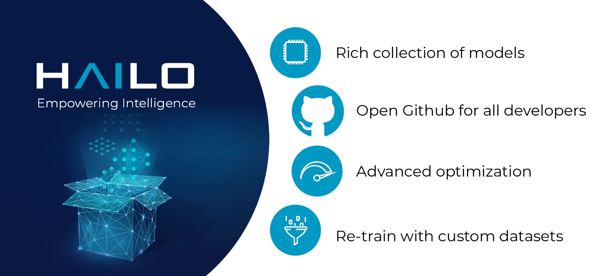

[](https://www.python.org/downloads/release/python-360/)
[](https://hailo.ai/contact-us/)
[](https://hailo.ai/contact-us/)
[](https://hailo.ai/contact-us/)
[HailoRT-4.8-<COLOR>.svg)](https://hailo.ai/contact-us/)
[](./LICENSE)


<p align="left">
  
</p>

# Hailo Model Zoo #

The Hailo Model Zoo provides pre-trained models for high-performance deep learning applications. Using the Hailo Model Zoo you can measure the full precision accuracy of each model, the quantized accuracy using the Hailo Emulator and measure the accuracy on the Hailo-8 device. Finally, you will be able to generate the Hailo Executable Format (HEF) binary file to speed-up development and generate high quality applications accelerated with Hailo-8. The Hailo Model Zoo also provides re-training instructions to train the models on custom datasets and models that were trained for specific use-cases on internal datasets.

<br>

<details>
<summary> Changelog </summary>

<details>
<summary> v2.2 </summary>

- Updated to use Dataflow Compiler v3.18 ([developer-zone](https://hailo.ai/developer-zone/))
- CLI change:
  - Hailo model zoo CLI is now working with an entry point - hailomz
  - quantize sub command was changed to optimize
  - Hailo model zoo data directory by default will be <code>~/.hailomz</code>
- New models:
  - yolov5xs_wo_spp_nms - a model which contains bbox decoding and confidence thresholding on Hailo-8
  - osnet_x1_0 - person ReID network
  - yolov5m_6.1 - yolov5m network from the latest tag of the repo (6.1) including silu activation
- New tasks:
  - person_attr_resnet_v1_18 - person attribute recognition
- ReID training docker for the Hailo model repvgg_a0_person_reid_512/2048

  Note: Ubuntu 18.04 will be deprecated in Hailo Model Zoo future version
  Note: Python 3.6 will be deprecated in Hailo Model Zoo future version

</details>


<details>
<summary> v2.1 </summary>

- Updated to use Dataflow Compiler v3.17 ([developer-zone](https://hailo.ai/developer-zone/))
- Parser commands were moved into model scripts
- Support Market-1501 Dataset
- Support a new model zoo task - ReID
- New models:
  - yolov5s_personface - person and face detector
  - repvgg_a0_person_reid_512 / repvgg_a0_person_reid_2048 - ReID networks which outputs a person embedding
    These models were trained in-house as part of our upcoming new application
  - stdc1 - Segmentation architecture for Cityscapes

</details>

<details>
<summary> v2.0 </summary>

- Updated to use Dataflow Compiler v3.16 ([developer-zone](https://hailo.ai/developer-zone/)) with TF version 2.5 which require CUDA11.2
- Updated to use HailoRT 4.6 ([developer-zone](https://hailo.ai/developer-zone/))
- Retraining Dockers - each retraining docker has a corresponding README file near it. New retraining dockers:
  - SSD
  - YOLOX
  - FCN
- New models:
  - yolov5l
- Introducing Hailo Models, in-house pretrained networks with compatible Dockerfile for retraining
  - yolov5m_vehicles (vehicle detection)
  - tiny_yolov4_license_plates (license plate detection)
  - lprnet (license plate recognition)
- Added new documentation to the [YAML structure](docs/YAML.md)

</details>

<details>
<summary> v1.5 </summary>

- Remove HailoRT installation dependency.
- Retraining Dockers
  - YOLOv3
  - NanoDet
  - CenterPose
  - Yolact
- New models:
  - unet_mobilenet_v2
- Support Oxford-IIIT Pet Dataset
- New mutli-network example: detection_pose_estimation which combines the following networks:
  - yolov5m_wo_spp_60p
  - centerpose_repvgg_a0
- Improvements:
  - nanodet_repvgg mAP increased by 2%
- New Tasks:
  - hand_landmark_lite from MediaPipe
  - palm_detection_lite from MediaPipe
  Both tasks are without evaluation module.

</details>

<details>
<summary> v1.4 </summary>

- Update to use Dataflow Compiler v3.14.0 ([developer-zone](https://hailo.ai/developer-zone/))
- Update to use HailoRT 4.3.0 ([developer-zone](https://hailo.ai/developer-zone/))
- Introducing [Hailo Models](docs/HAILO_MODELS.md) - in house pretrained networks with compatible Dockerfile for easy retraining:
  - yolov5m_vehicles - vehicle detector based on yolov5m architecture
  - tiny_yolov4_license_plates - license plate detector based on tiny_yolov4 architecture
- New Task: face landmarks detection
  - tddfa_mobilenet_v1
  - Support 300W-LP and AFLW2k3d datasets
- New features:
  - Support compilation of several networks together - a.k.a [multinets](docs/GETTING_STARTED.md#compile-multiple-networks-together)
  - CLI for printing [network information](docs/GETTING_STARTED.md#info)
- Retraining Guide:
  - New training guide for yolov4 with compatible Dockerfile
  - Modifications for yolov5 retraining

</details>

<details>
<summary> v1.3 </summary>

- Update to use Dataflow Compiler v3.12.0 ([developer-zone](https://hailo.ai/developer-zone/))
- New task: indoor depth estimation
  - fast_depth
  - Support NYU Depth V2 Dataset
- New models:
  - resmlp12 - new architecture support ([paper](https://arxiv.org/abs/2105.03404))
  - yolox_l_leaky
- Improvements:
  - ssd_mobilenet_v1 - in-chip NMS optimization (de-fusing)
- Model Optimization API Changes
  - Model Optimization parameters can be updated using the networks' model script files (*.alls)
  - Deprecated: quantization params in YAMLs
- Training Guide: new training guide for yolov5 with compatible Dockerfile
</details>


<details>
<summary> v1.2 </summary>

- New features:
  - YUV to RGB on core can be added through YAML configuration.
  - Resize on core can be added through YAML configuration.
- Support D2S Dataset
- New task: instance segmentation
  - yolact_mobilenet_v1 (coco)
  - yolact_regnetx_800mf_20classes (coco)
  - yolact_regnetx_600mf_31classes (d2s)
- New models:
  - nanodet_repvgg
  - centernet_resnet_v1_50_postprocess
  - yolov3 - [darkent based](https://github.com/AlexeyAB/darknet)
  - yolox_s_wide_leaky
  - deeplab_v3_mobilenet_v2_dilation
  - centerpose_repvgg_a0
  - yolov5s, yolov5m - original models from [link](https://github.com/ultralytics/yolov5/tree/v2.0)
  - yolov5m_yuv - contains resize and color conversion on HW
- Improvements:
  - tiny_yolov4
  - yolov4
- IBC and Equalization API change
- Bug fixes
</details>

<details>
<summary> v1.1 </summary>

- Support VisDrone Dataset
- New task: pose estimation
  - centerpose_regnetx_200mf_fpn
  - centerpose_regnetx_800mf
  - centerpose_regnetx_1.6gf_fpn
- New task: face detection
  - lightfaceslim
  - retinaface_mobilenet_v1
- New models:
  - hardnet39ds
  - hardnet68
  - yolox_tiny_leaky
  - yolox_s_leaky
  - deeplab_v3_mobilenet_v2
- Use your own network manual for YOLOv3, YOLOv4_leaky and YOLOv5.
</details>

<details>
<summary> v1.0 </summary>

- Initial release
- Support for object detection, semantic segmentation and classification networks
</details>

</details>

<br>

## Models

Hailo provides different pre-trained models in ONNX / TF formats and pre-compiled HEF (Hailo Executable Format) binary file to execute on the Hailo-8 device.
The models are divided to:
* [**PUBLIC MODELS**](docs/PUBLIC_MODELS.md) which were trained on publicly available datasets.
* [**HAILO MODELS**](docs/HAILO_MODELS.md) which were trained in-house for specific use-cases on internal datasets. Each Hailo Model is accompanied with retraining instructions.

<br>

## Retraining

Hailo also provides [**RETRAINING INSTRUCTIONS**](docs/RETRAIN_ON_CUSTOM_DATASET.md) to train a network from the Hailo Model Zoo with custom dataset.

<br>

## Benchmarks

List of Hailo's benchmarks can be found in [**hailo.ai**](https://hailo.ai/developer-zone/benchmarks/).
In order to reproduce the measurements please refer to the following [**page**](docs/BENCHMARKS.md).

<br>

## Usage
  ### Quick Start Guide
  * Install Hailo Dataflow Compiler and enter the virtualenv. In case you are not Hailo customer please contact [**hailo.ai**](https://hailo.ai/contact-us/)
  * Install HailoRT (optional). Required only if you want to run on Hailo-8. In case you are not Hailo customer please contact [**hailo.ai**](https://hailo.ai/contact-us/)
  * Clone the Hailo Model Zoo
     ```
     git clone https://github.com/hailo-ai/hailo_model_zoo.git
     ```
  * Run the setup script
    ```
    cd hailo_model_zoo; pip install -e .
    ```
  * Run the Hailo Model Zoo. For example, print the information of the MobileNet-v1 model:
    ```
    hailomz info mobilenet_v1
    ```


  ### Getting Started

  For full functionality please see the [**INSTALLATION GUIDE**](docs/GETTING_STARTED.md) page (full install instructions and usage examples). The Hailo Model Zoo is using the Hailo Dataflow Compiler for parsing, model optimization, emulation and compilation of the deep learning models. Full functionality includes:
  * Parse: model translation of the input model into Hailo's internal representation.
  * Profiler: generate profiler report of the model. The report contains information about your model and expected performance on the Hailo hardware.
  * Optimize: optimize the deep learning model for inference and generate a numeric translation of the input model into a compressed integer representation. For further information please see our [**OPTIMIZATION**](docs/OPTIMIZATION.md) page.
  * Compile: run the Hailo compiler to generate the Hailo Executable Format file (HEF) which can be executed on the Hailo hardware.
  * Evaluate: infer the model using the Hailo Emulator or the Hailo hardware and produce the model accuracy. 

For further information about the Hailo Dataflow Compiler please contact [**hailo.ai**](https://hailo.ai/contact-us/).

  <p align="center">
    
  </p>

<br>

## License

The Hailo Model Zoo is released under the MIT license. Please see the [**LICENSE**](LICENSE) file for more information.

<br>

## Contact

Please visit [**hailo.ai**](https://hailo.ai/) for support / requests / issues.
