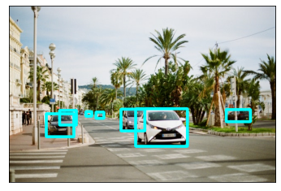

=================
Vehicle Detection
=================

Hailo's vehicle detection network (\ *yolov5m_vehicles*\ ) is based on YOLOv5m and was trained in-house with a single class. It can work under various weather and lighting conditions, and numerous camera angles.

Model Details
-------------

Architecture
^^^^^^^^^^^^

* | YOLOv5m
* | Number of parameters: 21.47M
* | GMACS: 25.63
* | Accuracy* : 46.0 mAP
  | \* Evaluated on internal dataset containing 5000 images

Inputs
^^^^^^

* RGB image with size of 1080x1920x3

  * Image resize to 640x640x3 occurs on-chip

* 
  Image normalization occurs on-chip

Outputs
^^^^^^^

* | Three output tensors with sizes of 20x20x18, 40x40x18 and 80x80x18
* | Each output contains 3 anchors that hold the following information:

  * | Bounding box coordinates ((x,y) centers, height, width)
  * | Box objectness confidence score
  * | Class probability confidence score

* | The above 6 values per anchor are concatenated into the 18 output channels

----

Comparison with Different Models
^^^^^^^^^^^^^^^^^^^^^^^^^^^^^^^^

The table below shows the performance of our trained network on an internal validation set containing 5000 images, compared with the performance of other benchmark models from the model zoo*.

.. list-table::
   :header-rows: 1

   * - network
     - **Vehicle mAP (@IoU=0.5:0.95)**
   * - **yolov5m_vehicles**
     - **46.0**
   * - yolov5m
     - 33.95
   * - yolov4_leaky
     - 33.13
   * - yolov3_gluon
     - 29.89

\* Benchmark models were trained on all COCO classes

----

Download
^^^^^^^^

| The compiled network can be downloaded from `here <https://hailo-model-zoo.s3.eu-west-2.amazonaws.com/HailoNets/LPR/vehicle_detector/yolov5m_vehicles/hailo10h/2025-09-17/yolov5m_vehicles.hef>`_.
| 
| Use the following command to measure model performance on hailo’s HW:

.. code-block::

   hailortcli run2 set-net yolov5m_vehicles.hef

----

.. include:: docs/TRAINING_GUIDE.rst

.. raw:: html

  <h3>Training on Custom Dataset</h3>
  A guide for training the pre-trained model on a custom dataset can be found <a href="./docs/TRAINING_GUIDE.rst">here</a>
