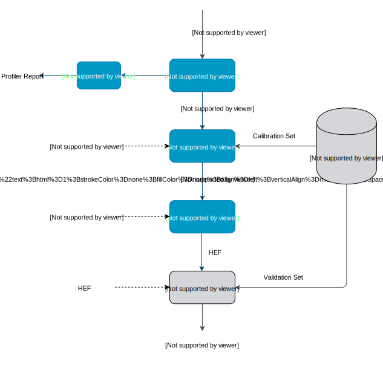

# Getting Started

This document provides install instructions and basic usage examples of the Hailo Model Zoo.

<br>

## System Requirements

- Ubuntu 18.04, Python 3.6
- Hailo Dataflow Compiler v3.14 (Obtain from [**hailo.ai**](http://hailo.ai))
- HailoRT 4.3.0 (Obtain from [**hailo.ai**](http://hailo.ai))
- The Hailo Model Zoo supports Hailo-8 connected via PCIe only.

<br>

## Install Instructions

1. Install the Hailo Dataflow compiler and enter the virtualenv (visit [**hailo.ai**](http://hailo.ai) for further instructions).
2. Install the HailoRT (visit [**hailo.ai**](http://hailo.ai) for further instructions).
3. Clone this repo:
```
git clone https://github.com/hailo-ai/hailo_model_zoo.git
```
4. run the setup script:
```
cd hailo_model_zoo; pip install -e .
```
5. For setting up datasets please see [**DATA.md**](DATA.md).
6. Verify Hailo-8 is connected through PCIe (required only to run on Hailo-8. Full-precision / emulation run on GPU.)
```
hailo fw-control identify
```
Expected output:
```
(hailo) Running command 'fw-control' with 'hailortcli'
Identifying board
Control Protocol Version: 2
Firmware Version: 4.3.0 (release,app)
Logger Version: 0
Board Name: Hailo-8
Device Architecture: HAILO8_B0
Serial Number: 0000000000000000
Part Number: HEV18B1C4GA
Product Name: HAILO-8 AI ACCELERATOR EVB
```

<br>

## Usage

### Flow Diagram

The following scheme shows high-level view of the model-zoo evaluation process, and the different stages in between.

<p align="center">
  
</p>

By default, each stage executes all of its previously necessary stages according to the above diagram. The post-parsing stages also have an option to start from the product of previous stages (i.e., the Hailo Archive (HAR) file), as explained below.
### Parsing

The pre-trained models are stored on AWS S3 and will be downloaded automatically when running the model zoo. To parse models into Hailo's internal representation and generate the Hailo Archive (HAR) file:
```
python hailo_model_zoo/main.py parse <model_name>
```

### Profiling

To generate the Hailo profiler report:
```
python hailo_model_zoo/main.py profile <model_name>
```
To generate the Hailo profiler report using a previously generated HAR file:
```
python hailo_model_zoo/main.py profile <model_name> --har /path/to/model.har
```
\* The report contains information about your model and expected performance on the Hailo hardware.

### Optimize

To optimize models, convert them from full precision into integer representation and generate a quantized Hailo Archive (HAR) file:
```
python hailo_model_zoo/main.py quantize <model_name>
```
To optimize the model starting from a previously generated HAR file:
```
python hailo_model_zoo/main.py quantize <model_name> --har /path/to/model.har
```
\* This step requires data for calibration. For additional information please see [**OPTIMIZATION.md**](OPTIMIZATION.md).

### Compile

To run the Hailo compiler and generate the Hailo Executable Format (HEF) file:
```
python hailo_model_zoo/main.py compile <model_name>
```
To generate the HEF starting from a previously generated HAR file:
```
python hailo_model_zoo/main.py compile <model_name> --har /path/to/model.har
```
### Evaluation

To evaluate models in full precision:
```
python hailo_model_zoo/main.py eval <model_name>
```
To evaluate models starting from a previosly generated Hailo Archive (HAR) file:
```
python hailo_model_zoo/main.py eval <model_name> --har /path/to/model.har
```
To evaluate models with the Hailo emulator (after quantization to integer representation - fast_numeric):
```
python hailo_model_zoo/main.py eval <model_name> --target emulator
```
To evaluate models on Hailo-8:
```
python hailo_model_zoo/main.py eval <model_name> --target hailo8
```
To limit the number of images for evaluation use the following flag:
```
python hailo_model_zoo/main.py eval <model_name> --eval-num <num-images>
```
To explore other options (for example: changing the default batch-size) use:
```
python hailo_model_zoo/main.py eval --help
```

### Visualization

To run visualization (without evaluation) and generate the output images:
```
python hailo_model_zoo/main.py eval <model_name> --visualize
```
To create a video file from the network predictions:
```
python hailo_model_zoo/main.py eval <model_name> --visualize --video-outpath /path/to/video_output.mp4
```

### Info

You can easily print information of any network exists in the model zoo, to get a sense of its input/output shape, parameters, oprerations, framework etc.

To print a model-zoo network information:
```
python hailo_model_zoo/main.py info <model_name>
```

Here is an example for printing information about mobilenet_v1:
```
python hailo_model_zoo/main.py info mobilenet_v1
```
Expected output:
```
<Hailo Model Zoo Info> Printing mobilenet_v1 Information
<Hailo Model Zoo Info> 
        task:                    classification
        input_shape:             224x224x3
        output_shape:            1x1x1001
        operations:              0.57G
        parameters:              4.22M
        framework:               tensorflow
        training_data:           imagenet train
        validation_data:         imagenet val
        eval_metric:             Accuracy (top1)
        full_precision_result:   71.02
        source:                  https://github.com/tensorflow/models/tree/v1.13.0/research/slim
        license_url:             https://github.com/tensorflow/models/blob/v1.13.0/LICENSE

```

### Compile multiple networks together
We can use multiple disjoint models in the same binary.
This is useful for running several small models on the device. 
```
python hailo_model_zoo/multi_main.py <config_name>
```
