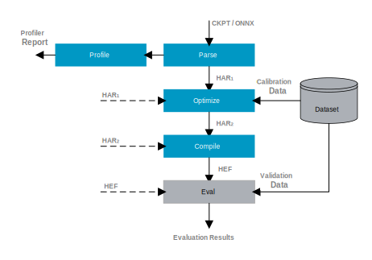

Getting Started
===============

| This document provides install instructions and basic usage examples of the Hailo Model Zoo.

System Requirements
-------------------

* Ubuntu 20.04/22.04, 64 bit (supported also on Windows, under WSL2)
* Python 3.8/3.9/3.10, including ``pip`` and ``virtualenv``
* Hailo Dataflow Compiler v3.25.0 (Obtain from `hailo.ai <http://hailo.ai>`_\ )
* HailoRT 4.15.0 (Obtain from `hailo.ai <http://hailo.ai>`_\ ) - required only for inference on Hailo-8.
* The Hailo Model Zoo supports Hailo-8 connected via PCIe only.
* Nvidia’s Pascal/Turing/Ampere GPU architecture (such as Titan X Pascal, GTX 1080 Ti, RTX 2080 Ti, or RTX A4000)
* GPU driver version 525
* CUDA 11.8
* CUDNN 8.9

Install Instructions
--------------------

Hailo Software Suite
^^^^^^^^^^^^^^^^^^^^

The model requires the corresponding Dataflow Compiler version, and the optional HailoRT version. Therefore it is recommended to use the 
`Hailo Software Suite <https://hailo.ai/developer-zone/sw-downloads/>`_, that includes all of Hailo's SW components and insures compatibility 
across products versions.

The Hailo Software Suite is composed of the Dataflow Compiler, HailoRT, TAPPAS and the Model Zoo (:ref:`see diagram below <sw_suite_figure>`).

.. _sw_suite_figure:

.. figure:: images/new_overview_2023-05.svg
   :alt: Detailed block diagram of Hailo software packages

   Detailed block diagram of Hailo software packages

Manual Installation
^^^^^^^^^^^^^^^^^^^

#. Install the Hailo Dataflow compiler and enter the virtualenv (visit `hailo.ai <http://hailo.ai>`_ for further instructions).
#. Install the HailoRT - required only for inference on Hailo-8 (visit `hailo.ai <http://hailo.ai>`_ for further instructions).
#. Clone the Hailo Model Zoo repo:

   .. code-block::

      git clone https://github.com/hailo-ai/hailo_model_zoo.git

#. Run the setup script:

   .. code-block::

      cd hailo_model_zoo; pip install -e .

#. For setting up datasets please see `DATA <DATA.rst>`_.

#. Verify Hailo-8 is connected through PCIe (required only to run on Hailo-8. Full-precision / emulation run on GPU.)

   .. code-block::

      hailo fw-control identify

   Expected output:

   .. code-block::

      (hailo) Running command 'fw-control' with 'hailortcli'
      Identifying board
      Control Protocol Version: 2
      Firmware Version: 4.6.0 (release,app)
      Logger Version: 0
      Board Name: Hailo-8
      Device Architecture: HAILO8_B0
      Serial Number: HLUTM20204900071
      Part Number: HM218B1C2FA
      Product Name: HAILO-8 AI ACCELERATOR M.2 MODULE

Upgrade Instructions
^^^^^^^^^^^^^^^^^^^^

If you want to upgrade to a specific Hailo Model Zoo version within a suite or on top of a previous installation not in the suite.

#. Pull the specific repo branch:

   .. code-block::

      git clone -b v2.6 https://github.com/hailo-ai/hailo_model_zoo.git

#. Run the setup script:

   .. code-block::

      cd hailo_model_zoo; pip install -e .

Usage
======

Flow Diagram
-------------

The following scheme shows high-level view of the model-zoo evaluation process, and the different stages in between.

By default, each stage executes all of its previously necessary stages according to the above diagram. The post-parsing stages also have an option to start from the product of previous stages (i.e., the Hailo Archive (HAR) file), as explained below. The operations are configured through a YAML file that exist for each model in the cfg folder. For a description of the YAML structure please see `YAML <YAML.rst>`_.

Parsing
-------

The pre-trained models are stored on AWS S3 and will be downloaded automatically when running the model zoo into your data directory. To parse models into Hailo's internal representation and generate the Hailo Archive (HAR) file:

.. code-block::

   hailomz parse <model_name>

* The default compilation target is Hailo-8. To compile for different architecture (Hailo-15H for example), use ``--hw_arch hailo15h`` as CLI argument:

.. code-block::

   hailomz parse <model_name> --hw-arch hailo15h

Profiling
---------

To generate the Hailo profiler report:

.. code-block::

   hailomz profile <model_name>

To generate the Hailo profiler report using a previously generated HAR file:

.. code-block::

   hailomz profile <model_name> --har /path/to/model.har

* The report contains information about your model and expected performance on the Hailo hardware.

Optimize
--------

To optimize models, convert them from full precision into integer representation and generate a quantized Hailo Archive (HAR) file:

.. code-block::

   hailomz optimize <model_name>

To optimize the model starting from a previously generated HAR file:

.. code-block::

   hailomz optimize <model_name> --har /path/to/model.har

You can use your own images by giving a directory path to the optimization process, with the following supported formats (.jpg,.jpeg,.png):

.. code-block::

   hailomz optimize <model_name> --calib-path /path/to/calibration/imgs/dir/

* This step requires data for calibration. For additional information please see `OPTIMIZATION <OPTIMIZATION.rst>`_.

In order to achieve highest performance, one could use the performance flag:

.. code-block::

    hailomz optimize <model_name> --performance

The flag will be ignored on models that do not support this feature.
The default and performance model scripts are located on `hailo_model_zoo/cfg/alls/`

To add input conversion to the model, one could use the input conversion flag:

.. code-block::

    hailomz optimize <model_name> --input-conversion nv12_to_rgb

Do not use the flag if an input conversion already exist in the alls or in the YAML.

To add input resize to the model, one could use the resize flag:

.. code-block::

    hailomz optimize <model_name> --resize 1080 1920

Do not use the flag if resize already exist in the alls or in the YAML.

Compile
-------

To run the Hailo compiler and generate the Hailo Executable Format (HEF) file:

.. code-block::

   hailomz compile <model_name>

By default the compilation target is Hailo-8. To compile for a different architecture use ``--hw-arch`` command line argument:

.. code-block::

   hailomz compile <model_name> --hw-arch hailo15h

To generate the HEF starting from a previously generated HAR file:

.. code-block::

   hailomz compile <model_name> --har /path/to/model.har --hw-arch <hailo8|hailo15h>

In order to achieve highest performance, one could use the performance flag:

.. code-block::

    hailomz optimize <model_name> --performance --hw-arch <hailo8|hailo15h>

The flag will be ignored on models that do not support this feature.
The default and performance model scripts are located on `hailo_model_zoo/cfg/alls/`

To add input conversion to the model, one could use the input conversion flag:

.. code-block::

    hailomz compile <model_name> --input-conversion nv12_to_rgb

Do not use the flag if an input conversion already exist in the alls or in the YAML.

To add input resize to the model, one could use the resize flag:

.. code-block::

    hailomz compile <model_name> --resize 1080 1920

Do not use the flag if resize already exist in the alls or in the YAML.

Evaluation
----------

To evaluate models in full precision:

.. code-block::

   hailomz eval <model_name>

To evaluate models starting from a previously generated Hailo Archive (HAR) file:

.. code-block::

   hailomz eval <model_name> --har /path/to/model.har

To evaluate models with the Hailo emulator (after quantization to integer representation - fast_numeric):

.. code-block::

   hailomz eval <model_name> --target emulator

To evaluate models on Hailo-8:

.. code-block::

   hailomz eval <model_name> --target hailo8

If multiple Hailo-8 devices are available, it's possible to select a specific one

.. code-block::

   # Device id looks something like 0000:41:00.0
   hailomz eval <model_name> --target <device_id>
   # This command can be used to list available devices
   hailomz eval --help

To limit the number of images for evaluation use the following flag:

.. code-block::

   hailomz eval <model_name> --data-count <num-images>

To eval model with additional input conversion, one could use the input conversion flag:

.. code-block::

    hailomz eval <model_name> --input-conversion nv12_to_rgb

Do not use the flag if an input conversion already exist in the alls or in the YAML.

To eval model with input resize, one could use the resize flag:

.. code-block::

    hailomz eval <model_name> --resize 1080 1920

Do not use the flag if resize already exist in the alls or in the YAML.

To explore other options (for example: changing the default batch-size) use:

.. code-block::

   hailomz eval --help

* Currently MZ evaluation can be done only on hailo8

Visualization
-------------

To run visualization (without evaluation) and generate the output images:

.. code-block::

   hailomz eval <model_name> --visualize

To create a video file from the network predictions:

.. code-block::

   hailomz eval <model_name> --visualize --video-outpath /path/to/video_output.mp4

Info
----

You can easily print information of any network exists in the model zoo, to get a sense of its input/output shape, parameters, operations, framework etc.

To print a model-zoo network information:

.. code-block::

   hailomz info <model_name>

Here is an example for printing information about mobilenet_v1:

.. code-block::

   hailomz info mobilenet_v1

Expected output:

.. code-block::

   <Hailo Model Zoo Info> Printing mobilenet_v1 Information
   <Hailo Model Zoo Info>
           task:                    classification
           input_shape:             224x224x3
           output_shape:            1x1x1001
           operations:              0.57G
           parameters:              4.22M
           framework:               tensorflow
           training_data:           imagenet train
           validation_data:         imagenet val
           eval_metric:             Accuracy (top1)
           full_precision_result:   71.02
           source:                  https://github.com/tensorflow/models/tree/v1.13.0/research/slim
           license_url:             https://github.com/tensorflow/models/blob/v1.13.0/LICENSE

Compile multiple networks together
----------------------------------

We can use multiple disjoint models in the same binary.
This is useful for running several small models on the device.

.. code-block::

   python hailo_model_zoo/multi_main.py <config_name>

TFRecord to NPY conversion
----------------------------

In some situations you might want to convert the tfrecord file to npy file (for example, when explicitly using the Dataflow Compiler for quantization). In order to do so, run the command:

.. code-block::

   python hailo_model_zoo/tools/conversion_tool.py /path/to/tfrecord_file resnet_v1_50 --npy
