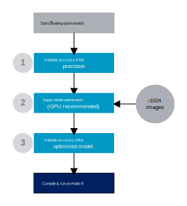

# Model Optimization

## Introduction

Model optimization is the stage of converting a full precision model to an optimized model which will be compiled to the Hailo device. This stage includes numeric translation of the input model into a compressed integer representation as well as optimizing the model architecture to best fit the Hailo hardware. Compressing deep learning model induce degradation for the model's accuracy. For example, in the following table we compare the accuracy of full precision ResNet V1 18 with the compressed 8-bits weights and activation representation:

<center>

| Precision        | Top-1 | 
| ---------------- | ------|
| Full precision   | 68.85 |
| 8-bit (emulator) | 68.54 |

</center>

The main goal of the model optimization step is to prepare the model for compilation with minimum degradation as possible.

<br>

## Optimization Workflow

The model optimization has two main steps: full precision optimization and quantization optimization.

- Full precision optimization includes any changes to the model in the floating point precision domain, for example, Equalization (Meller2019), TSE (Vosco2021) and pruning.
- Quantization includes compressing the model from floating point to integer representation of the weights and activations (4/8/16 bits) and algorithms to improve the model's accuracy, such as IBC (Finkelstein2019) and QFT.

Both steps may degrade the model accuracy, therefore, evaluation is needed to verify the model accuracy. This workflow is depicted in the following diagram:

<p align="center">
  
</p>

1. First stage includes full precision validation. This stage is important for making sure parsing was successful and we built the pre/post processing and evaluation of the model correctly. In the Hailo Model Zoo, we can execute the following which will infer a specific model in full precision to verify accuracy is correct:
  ```
  python hailo_model_zoo/main.py eval <model_name>
  ```

2. Next, we can call the model optimization API to generate an optimized model. Without fine-tune which will be described in the next item, this step requires a small amount of images for calibration. This step should be used as a starting point for any model unless you are using 4-bit weights compression. It is fast (even on a CPU) and you can easily validate its performance using the Hailo emulator. For example, running ResNet V1 50:
  ```
  python hailo_model_zoo/main.py eval resnet_v1_50 --target emulator
  ```

3. Lastly, in cases where we are using 4-bit weights or just would like to further optimize the accuracy, we can leverage back-propagation to optimize the quantize model using knowledge distillation. This step is called fine-tune and it is executed by setting a specific field in the model optimization API. Fine-tune requires more data, without labeling, for training and runs on GPU. For example, evaluating YOLOv5m with fine-tune (which include 4-bit weights):
  ```
  python hailo_model_zoo/main.py eval yolov5m --target emulator
  ```

Once optimization is finished and met our accuracy requirements, we can compile the optimized model. For example:
```
python hailo_model_zoo/main.py compile yolov5m --har yolov5m.har
```

<br>

## Citations

```
@InProceedings{Vosco2021,
  title = {Tiled Squeeze-and-Excite: Channel Attention With Local Spatial Context},
  author = {Niv Vosco and Alon Shenkler and Mark Grobman},
  booktitle = {ICCV},
  year = {2021}
}
@InProceedings{Finkelstein2019,
  title = {Fighting Quantization Bias With Bias},
  author = {Alexander Finkelstein and Uri Almog and Mark Grobman},
  booktitle = {CVPR},
  year = {2019}
}
@InProceedings{Meller2019,
  title = {Same, Same But Different - Recovering Neural Network Quantization Error Through Weight Factorization},
  author = {Eldad Meller and Alexander Finkelstein and Uri Almog and Mark Grobman},
  booktitle = {ICML},
  year = {2019}
}
```