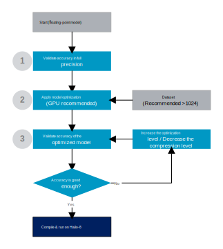

# Model Optimization

## Introduction

Model optimization is the stage of converting a full precision model to an optimized model which will be compiled to the Hailo device. This stage includes numeric translation of the input model into a compressed integer representation as well as optimizing the model architecture to best fit the Hailo hardware. Compressing deep learning model induce degradation for the model's accuracy. For example, in the following table we compare the accuracy of full precision ResNet V1 18 with the compressed 8-bits weights and activation representation on ImageNet-1K:

<center>

| Precision        | Top-1 |
| ---------------- | ------|
| Full precision   | 68.85 |
| 8-bit (emulator) | 68.54 |

</center>

The main goal of the model optimization step is to prepare the model for compilation with minimum degradation as possible.

<br>

## Optimization Workflow

The model optimization has two main steps: full precision optimization and quantization optimization.

- Full precision optimization includes any changes to the model in the floating point precision domain, for example, Equalization ([Meller2019](#citations)), TSE ([Vosco2021](#citations)) and pruning.
- Quantization includes compressing the model from floating point to integer representation of the weights and activations (4/8/16 bits) and algorithms to improve the model's accuracy, such as IBC ([Finkelstein2019](#citations)) and QFT.

Both steps may degrade the model accuracy, therefore, evaluation is needed to verify the model accuracy. This workflow is depicted in the following diagram:

<p align="center">
  
</p>

1. First step includes full precision validation. This step is important to make sure parsing was successful and we built the pre/post processing and evaluation of the model correctly. In the Hailo Model Zoo, we can execute the following which will infer a specific model in full precision to verify that the accuracy is correct (this will be our baseline for measuring degradation):
  ```
  hailomz eval <model_name>
  ```

2. Next, we call the model optimization API to generate an optimized model. Note, it is recommended to run this step on a GPU machine with dataset size of at least 1024 images.
  ```
  hailomz optimize <model_name>
  ```

3. Lastly, we verify the accuracy of the optimized model. In case the results are not good enough we should repeat the process with different configurations of the optimization/compression levels:
  ```
  hailomz eval <model_name> --target emulator --har <model_name>.har
  ```

Once optimization is finished and met our accuracy requirements, we can compile the optimized model. For example:
```
hailomz compile <model_name> --har <model_name>.har
```

<br>

## Citations

```
@InProceedings{Vosco2021,
  title = {Tiled Squeeze-and-Excite: Channel Attention With Local Spatial Context},
  author = {Niv Vosco and Alon Shenkler and Mark Grobman},
  booktitle = {ICCV},
  year = {2021}
}
@InProceedings{Finkelstein2019,
  title = {Fighting Quantization Bias With Bias},
  author = {Alexander Finkelstein and Uri Almog and Mark Grobman},
  booktitle = {CVPR},
  year = {2019}
}
@InProceedings{Meller2019,
  title = {Same, Same But Different - Recovering Neural Network Quantization Error Through Weight Factorization},
  author = {Eldad Meller and Alexander Finkelstein and Uri Almog and Mark Grobman},
  booktitle = {ICML},
  year = {2019}
}
```