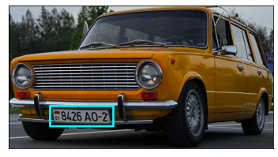

=======================
License Plate Detection
=======================

Hailo's license detection network (\ *tiny_yolov4_license_plates*\ ) is based on Tiny-YOLOv4 and was trained in-house using Darknet with a single class. It expects a single vehicle and can work under various weather and lighting conditions, on different vehicle types and numerous camera angles.

Model Details
-------------

Architecture
^^^^^^^^^^^^

* | Tiny-YOLOv4
* | Number of parameters: 5.87M
* | GMACS: 3.4
* | Accuracy\* : 73.45 mAP
  | \ * Evaluated on internal dataset containing 5000 images

Inputs
^^^^^^

* RGB image with size of 416x416x3
* 
  Image normalization occurs on-chip

Outputs
^^^^^^^

* Two output tensors with sizes of 13x13x18 and 26x26x18.
* Each output contains 3 anchors that hold the following information:

  * Bounding box coordinates ((x,y) centers, height, width)
  * Box objectness confidence score
  * Class probability confidence score

* The above 6 values per anchor are concatenated into the 18 output channels

----

Download
^^^^^^^^

| The pre-compiled network can be downloaded from `here <https://hailo-model-zoo.s3.eu-west-2.amazonaws.com/HailoNets/LPR/lp_detector/tiny_yolov4_license_plates/2021-12-23/tiny_yolov4_license_plates.hef>`_.
| Use the following command to measure model performance on hailo’s HW:

.. code-block::

   hailortcli benchmark tiny_yolov4_license_plates.hef

----

.. include:: docs/TRAINING_GUIDE.rst

.. raw:: html

  <h3>Training on Custom Dataset</h3>
  A guide for finetuning the pre-trained model on a custom dataset can be found <a href="./docs/TRAINING_GUIDE.rst">here</a>
