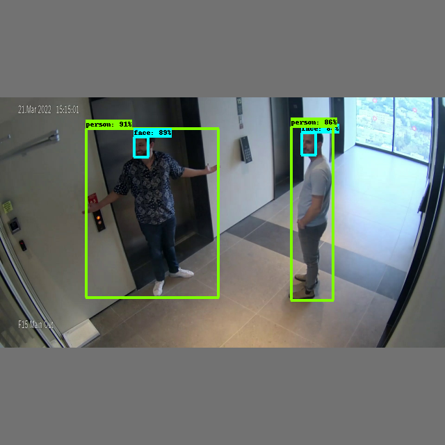

# Person-Face Detection
<p align="center">
  
</p>

<br>

  Hailo's person-face detection network (*yolov5s_personface*) is based on YOLOv5s and was trained in-house with two classes [person, face]. It can work under various lighting conditions, number of people, and numerous camera angles.   
  
  ## Model Details

  ### Architecture
  * YOLOv5s 
  * Number of parameters: 7.25M
  * GMACS: 8.38G
  * Accuracy<sup>*</sup>: 47.5 mAP
<br>\* Evaluated on internal dataset containing 6000 images
  
  ### Inputs
  - RGB image with various input sizes
    -  Image resize to 640x640x3 occurs on-chip
  - Image normalization occurs on-chip

  ### Outputs
  - Three output tensors with sizes of 20x20x21, 40x40x21 and 80x80x21
  - Each output contains 3 anchors that hold the following information:
    - Bounding box coordinates ((x,y) centers, height, width)
    - Box objectness confidence score
    - Class probablity confidence score per class
  - The above 7 values per anchor are concatenated into the 21 output channels

<br>

---
<br> 

### Comparison with Different Models
The table below shows the performance of our trained network on an internal validation set containing 6000 images, compared to other benchmark models from the model zoo<sup>*</sup>.
  
  network | ```Person mAP (@IoU=0.5:0.95)```
  --- | ---
  ***yolov5s_personface*** | ***34.2***
  yolov5s<sup>*</sup> | 23.0
  yolov5m<sup>*</sup> | 25.6

  \* Benchmark models were trained on all COCO classes, and evaluated on our internal validation set, on 'Person' class only.

<br>

---
<br> 

### Download
The pre-compiled network can be downloaded from [**here**](https://hailo-model-zoo.s3.eu-west-2.amazonaws.com/HailoNets/MCPReID/personface_detector/yolov5s_personface/2022-04-01/yolov5s_personface.hef)
<br><br>
Use the following command to measure model performance on hailo’s HW:
```
hailortcli benchmark yolov5s_personface.hef
```
<br>

---
<br> 

## Training on Custom Dataset
A guide for training the pre-trained model on a custom dataset can be found [**here**](./docs/TRAINING_GUIDE.md)
