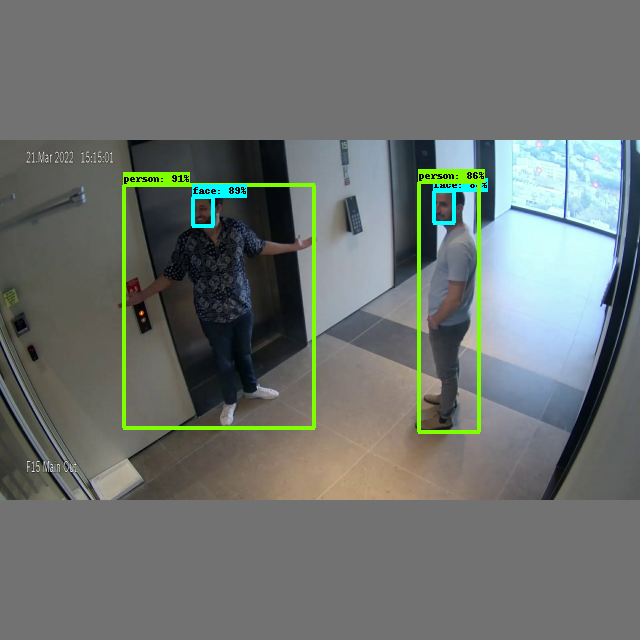

=====================
Person-Face Detection
=====================

Hailo's person-face detection network (\ *yolov5s_personface*\ ) is based on YOLOv5s and was trained in-house with two classes [person, face]. It can work under various lighting conditions, number of people, and numerous camera angles.   

Model Details
-------------

Architecture
^^^^^^^^^^^^

* | YOLOv5s 
* | Number of parameters: 7.25M
* | GMACS: 8.38G
* | Accuracy* : 47.5 mAP
  | \* Evaluated on internal dataset containing 6000 images

Inputs
^^^^^^

* RGB image with various input sizes

  * Image resize to 640x640x3 occurs on-chip

* 
  Image normalization occurs on-chip

Outputs
^^^^^^^

* Three output tensors with sizes of 20x20x21, 40x40x21 and 80x80x21
* Each output contains 3 anchors that hold the following information:

  * Bounding box coordinates ((x,y) centers, height, width)
  * Box objectness confidence score
  * Class probability confidence score per class

* The above 7 values per anchor are concatenated into the 21 output channels

----

Comparison with Different Models
^^^^^^^^^^^^^^^^^^^^^^^^^^^^^^^^

The table below shows the performance of our trained network on an internal validation set containing 6000 images, compared to other benchmark models from the model zoo*.

.. list-table::
   :header-rows: 1

   * - network
     - **Person mAP (@IoU=0.5:0.95)**
   * - **yolov5s_personface**
     - **34.2**
   * - yolov5s*
     - 23.0
   * - yolov5m*
     - 25.6

\* Benchmark models were trained on all COCO classes, and evaluated on our internal validation set, on 'Person' class only.

----

Download
^^^^^^^^

| The compiled network can be downloaded from `here <https://hailo-model-zoo.s3.eu-west-2.amazonaws.com/HailoNets/MCPReID/personface_detector/yolov5s_personface/hailo10h/2025-09-17/yolov5s_personface.hef>`_
|
| Use the following command to measure model performance on hailo’s HW:

.. code-block::

   hailortcli run2 set-net yolov5s_personface.hef

----

.. include:: docs/TRAINING_GUIDE.rst

.. raw:: html

  <h3>Training on Custom Dataset</h3>
  A guide for training the pre-trained model on a custom dataset can be found <a href="./docs/TRAINING_GUIDE.rst">here</a>
