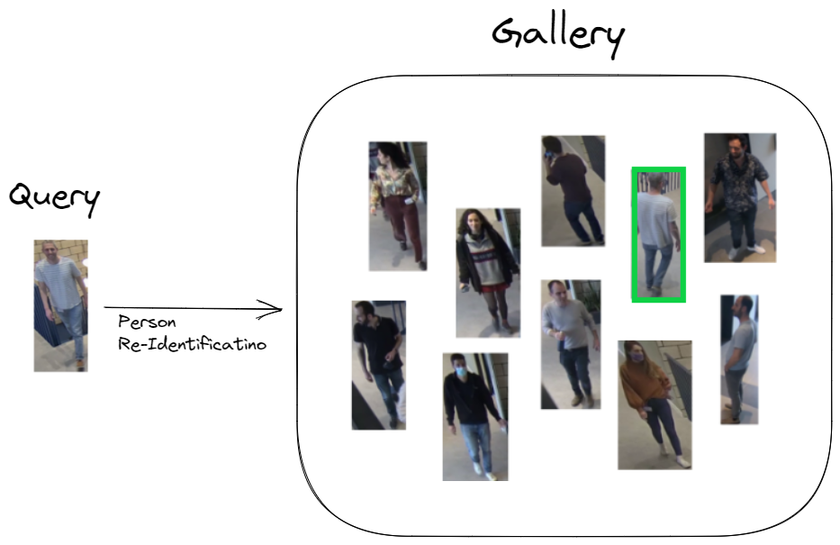

# Person-ReID
<p align="center">
  
</p>

<br>

  Hailo's person Re-Identification network is based on RepVGG_A0 and was trained in-house using several Person ReID datasets. It can work under various lighting conditions and numerous camera angles. 2 Models were trained independently - using 512 & 2048 embedding dimensions.
  
  ## Model Details

  ### Architecture (2048 / 512)
  * RepVGG_A0 
  * Number of parameters: 9.65M / 7.68M
  * GMACS: 0.89 / 0.89
  * Rank1<sup>*</sup>: 89.8% / 89.3%
<br>\* Evaluated on Market1501 dataset 
  
  ### Inputs
  - RGB image with various input sizes
    -  Image resize to 256x128x3 occurs on-chip
  - Image normalization occurs on-chip

  ### Outputs
  - Single embedding vector (2048 / 512 dim) per query

<br>

---
<br> 

## Comparison with Different Models
The table below shows the performance of our trained network on Market1501 dataset.
  
  network | ```Person Rank1```
  --- | ---
  ***repvgg_a0_person_reid_512*** | ***89.3***
  ***repvgg_a0_person_reid_2048*** | ***89.8***


<br>

---
<br> 

### Download
The pre-compiled network can be download from:
- [**512-dim**](https://hailo-model-zoo.s3.eu-west-2.amazonaws.com/HailoNets/MCPReID/reid/repvgg_a0_person_reid_512/2022-04-18/repvgg_a0_person_reid_512.hef)
- [**2048-dim**](https://hailo-model-zoo.s3.eu-west-2.amazonaws.com/HailoNets/MCPReID/reid/repvgg_a0_person_reid_2048/2022-04-18/repvgg_a0_person_reid_2048.hef)
<br><br>
Use the following command to measure model performance on hailo’s HW:
```
hailortcli benchmark repvgg_a0_person_reid_512.hef
hailortcli benchmark repvgg_a0_person_reid_2048.hef
```
<br>

---
<br> 

## Training on Custom Dataset
A guide for training the pre-trained model on a custom dataset can be found [**here**](./docs/TRAINING_GUIDE.md)
