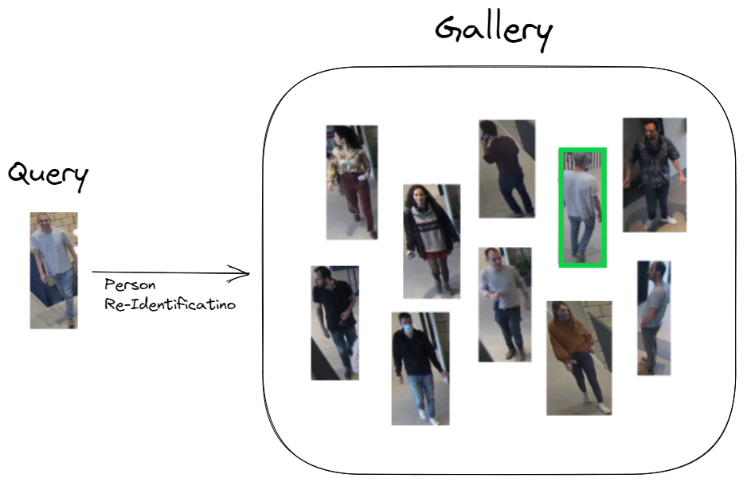

===========
Person-ReID
===========

Hailo's person Re-Identification network is based on RepVGG_A0 and was trained in-house using several Person ReID datasets. It can work under various lighting conditions and numerous camera angles. 2 Models were trained independently - using 512 & 2048 embedding dimensions.

Model Details
-------------

Architecture (2048 / 512)
^^^^^^^^^^^^^^^^^^^^^^^^^

* | RepVGG_A0 
* | Number of parameters: 9.65M / 7.68M
* | GMACS: 0.89 / 0.89
* | Rank1* : 89.8% / 89.3%
  | \* Evaluated on Market1501 dataset 

Inputs
^^^^^^

* RGB image with various input sizes

  * Image resize to 256x128x3 occurs on-chip

* 
  Image normalization occurs on-chip

Outputs
^^^^^^^

* Single embedding vector (2048 / 512 dim) per query

----

Comparison with Different Models
--------------------------------

The table below shows the performance of our trained network on Market1501 dataset.

.. list-table::
   :header-rows: 1

   * - network
     - **Person Rank1**
   * -   **repvgg_a0_person_reid_512**
     - **89.3**
   * -   **repvgg_a0_person_reid_2048**
     - **89.8**

----

Download
^^^^^^^^

The compiled network can be download from:

* | `512-dim <https://hailo-model-zoo.s3.eu-west-2.amazonaws.com/HailoNets/MCPReID/reid/repvgg_a0_person_reid_512/hailo10h/2025-09-17/repvgg_a0_person_reid_512.hef>`_
* | `2048-dim <https://hailo-model-zoo.s3.eu-west-2.amazonaws.com/HailoNets/MCPReID/reid/repvgg_a0_person_reid_2048/hailo10h/2025-09-17/repvgg_a0_person_reid_2048.hef>`_
  | Use the following command to measure model performance on hailo’s HW:

  .. code-block::

     hailortcli run2 set-net repvgg_a0_person_reid_512.hef
     hailortcli run2 set-net repvgg_a0_person_reid_2048.hef

----

.. include:: docs/TRAINING_GUIDE.rst

.. raw:: html

  <h3>Training on Custom Dataset</h3>
  A guide for training the pre-trained model on a custom dataset can be found <a href="./docs/TRAINING_GUIDE.rst">here</a>
