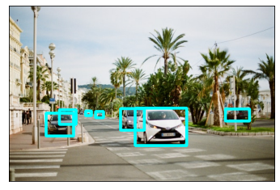

# Vehicle Detection
<p align="center">
  
</p>

<br>

  Hailo's vehicle detection network (*yolov5m_vehicles*) is based on YOLOv5m and was trained in-house with a single class. It can work under various weather and lighting conditions, and numerous camera angles.   
  
  ## Model Details

  ### Architecture
  * YOLOv5m 
  * Number of parameters: 21.47M
  * GMACS: 25.63
  * Accuracy<sup>*</sup>: 46.5 mAP
<br>\* Evaluated on internal dataset containing 5000 images
  ### Inputs
  * RGB image with size of 640x640x3 
  * Image normalization occurs on-chip

  ### Outputs
  - Three output tensors with sizes of 20x20x18, 40x40x18 and 80x80x18
  - Each output contains 3 anchors that hold the following information:
    - Bounding box coordinates ((x,y) centers, height, width)
    - Box objectness confidence score
    - Class probablity confidence score
  - The above 6 values per anchor are concatenated into the 18 output channels

<br>

---
<br> 

### Comparison with Different Models
The table below shows the performance of our trained network on an internal validation set containing 5000 images, compared with the performance of other benchmark models from the model zoo<sup>*</sup>. 
  
  network | ```Vehcile mAP (@IoU=0.5:0.95)```
  --- | ---
  ***yolov5m_vehicles*** | ***46.5***
  yolov5m | 33.95
  yolov4_leaky | 33.13
  yolov3_gluon | 29.89
  \* Benchmark models were trained on all COCO classes

<br>

---
<br> 

### Download
The pre-compiled network can be downloaded from [**here**](https://hailo-model-zoo.s3.eu-west-2.amazonaws.com/HailoNets/LPR/vehicle_detector/yolov5m_vehicles/2021-11-16/yolov5m_vehicles.hef).
<br><br>
Use the following command to measure model performance on hailo’s HW:
```
hailortcli benchmark yolov5m_vehicles.hef
```
<br>

---
<br> 

## Training on Custom Dataset
A guide for training the pre-trained model on a custom dataset can be found [**here**](./docs/TRAINING_GUIDE)
